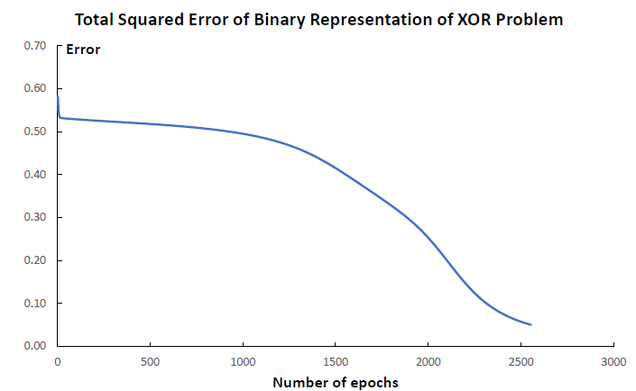
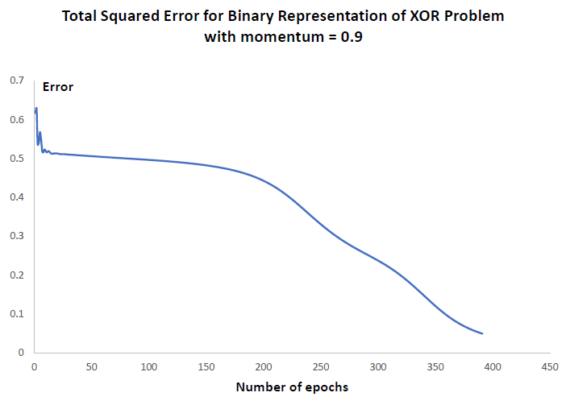
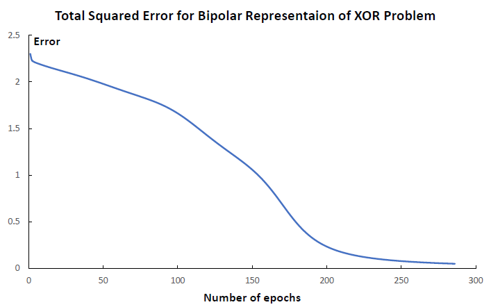
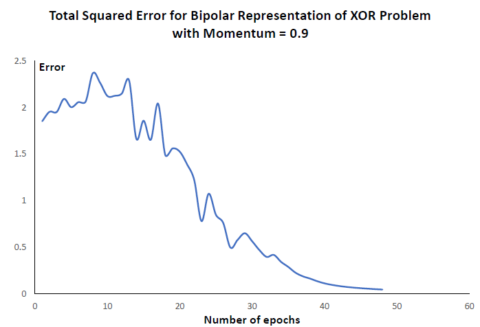

## Backpropagation Learning

### Abstract

This folder contains the code for 

+  Implementing a two-layer neural network

+  Training the network with error-backpropagation algorithm

The nerual network has two inputs, four neurons in the hidden layer, and one neuron in the output layer. The network is trained based on the XOR gate truth table

### Files in the folder

+ `NeuralNetMain.java` has the `main` function of the project and defines some hyperparameters of the neural network

+ `NeuralNetwork.java` defines the basic structure of the neural network and has the algorithms of forward propagation and backpropagation

### Demo

#### Binary input

+  When `momentum` = 0

+  When `momentum` = 0.9

#### Bipolar input

+  When `momentum` = 0

+  When `momentum` = 0.9

