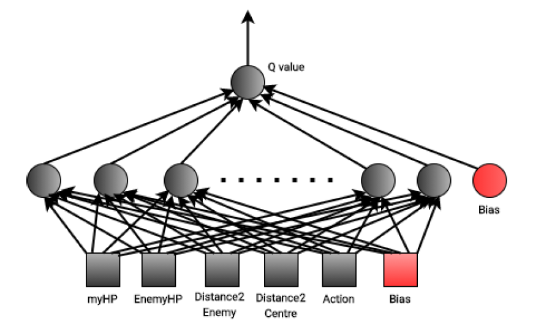
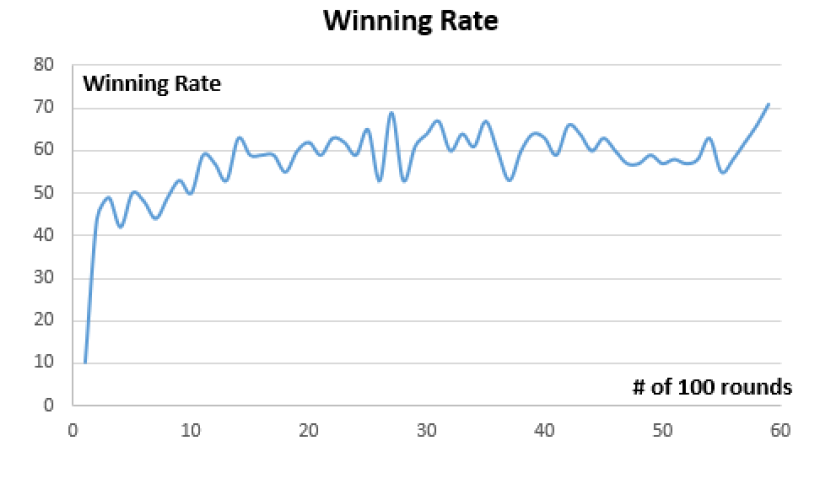

## Reinforcement Learning with Backpropagation

### Abstract

This folder contains the code for 

+  Implementing a look-up table for reinforcement learning

+  Connecting the look-up table with the state-action pairs of the robot tank in Robocode

+  Logging from Robocode tank to an external file

+  Implementing a two-layer neural network

+  Training the network with error-backpropagation algorithm

### Files in the folder

+ `LookUpTableV2.java` defines the look-up table and some basic relevant functions used in this milestone project

+ `myRobotTankV2.java` defines the state-action pair of the robot tank and the workflow of the reinforcement learning process

+ `LogFileV2.java` define a LogFile class and is used for enabling diagnostic data to be written from a robocode tank to a file

+ `NeuralNetMainV2.java` has the `main` function of the project and defines some hyperparameters of the neural network

+ `NeuralNetworkV2.java` defines the basic structure of the neural network and has the algorithms of forward propagation and backpropagation

### Final architecture of the neural network

### Final learning proformance

I train the robot with 6000 battle rounds and the winning rate is calculated when every 100 rounds are finished. During these 6000 rounds, the robot winning rate is changing from 10% at the very beginning to around 70% eventually

