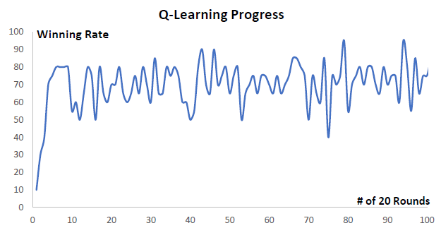
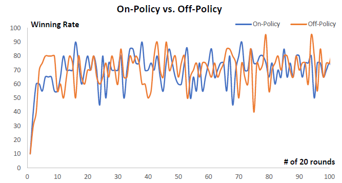
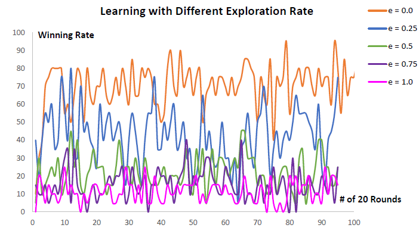

## Reinforcement Learning with LUT

### Abstract

This folder contains the code for 

+  Implementing a look-up table for reinforcement learning

+  Connecting the look-up table with the state-action pairs of the robot tank in Robocode

+  Logging from Robocode tank to an external file

### Files in the folder

+ `LookUpTable.java` defines the look-up table and some basic relevant functions used in this milestone project

+ `myRobotTank.java` defines the state-action pair of the robot tank and the workflow of the reinforcement learning process

+ `LogFile.java` define a LogFile class and is used for enabling diagnostic data to be written from a robocode tank to a file

### Q learning proformance

I set the `exploration rate` as 0.0, which means the robot tank is performing the greedy action all the time. Also, I decide to do the measurement on an `off-policy` algorithm, specifically the Q-learning algorithm. I choose the `winning rate` as the parameter that reflects the progress of learning. As the Figure 1.a below depicts, the winning rate has a generally increasing trend, even though it is not monotonically increasing. Eventually, the `winning rate` fluctuates between 50% and 90%

### Comparison between on-policy and off-policy

I set the `exploration rate` as 0.0 as well. I am testing my robot tank’s learning performance on the `on-policy` algorithm and `off-policy` algorithm respectively.

The `off-policy` learning has a better performance when compared to the `on-policy` learning, which can be elaborated on two parts:

+  At the first 10×20 rounds, the slope of the `off-policy` curve is steeper than that of the `on-policy` curve. Moreover, the maximum value that the `off-policy` curve reaches is much higher than the maximum value that the `on-policy` curve can reach during the first 200 rounds

+  When the `winning rate` is fluctuating between 50% and 90%, the envelop of the `off-policy` curve is higher than that of the `on-policy` curve.

Theoretically, this result makes sense, because `off-policy` algorithm forces the agent (i.e. the robot tank) to perform the greedy action that can yield maximum rewards, and this motivates the agent to have a better learning performance

### Exploring different exploration rates

I test my robot tank’s learning progress under a combination of different `exploration rates`, which are `0.0`, `0.25`, `0.5`, `0.75`, and `1.0`

As the `exploration rate` increases, the robot tank’s learning performance becomes worse and worse. This is because as the `exploration rate` increases, it is more possible for the robot tank to select and explore an action randomly instead of selecting the greedy action that can yield the best reward. In other words, as the `exploration rate` is increasing, the rewards that the robot can get starts getting decreased. Under this circumstance, the learning motivation of the robot tank is decreasing as well, and this leads to the winning rate starts dropping dramatically. Eventually, the learning performance becomes worse and worse
